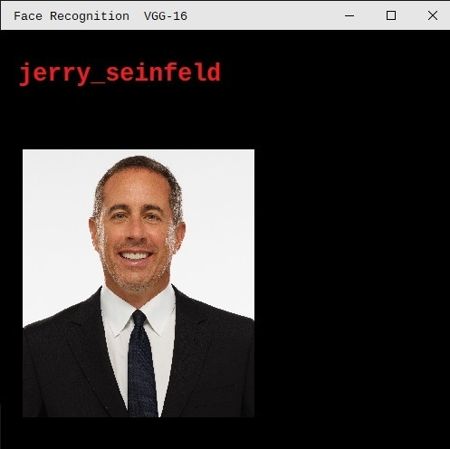
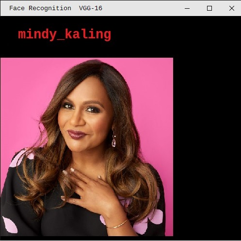

# face-recognition-VGG16
> VGG16 is a convolutional neural network model. which was used to win ILSVR(Imagenet) competition in 2014. It is considered to be one of the excellent vision model architecture till date. Most unique thing about VGG16 is that instead of having a large number of hyper-parameter they focused on having convolution layers of 3x3 filter with a stride 1 and always used same padding and maxpool layer of 2x2 filter of stride 2. It follows this arrangement of convolution and max pool layers consistently throughout the whole architecture. In the end it has 2 FC(fully connected layers) followed by a softmax for output. The 16 in VGG16 refers to it has 16 layers that have weights. This network is a pretty large network and it has about 138 million (approx) parameters.
### Face recognition using VGG-16 model

 ## Requirements
 - *Tensorflow*
 - *Keras*
 - *Pillow*
 - *opencv*
 - *numpy*
### To install all requirements
```sh
 pip install requiremnets.txt
```
### To clone repo 
```sh
 git clone https://github.com/PBSH56/face-recognition-VGG16.git
```
### Testing result


